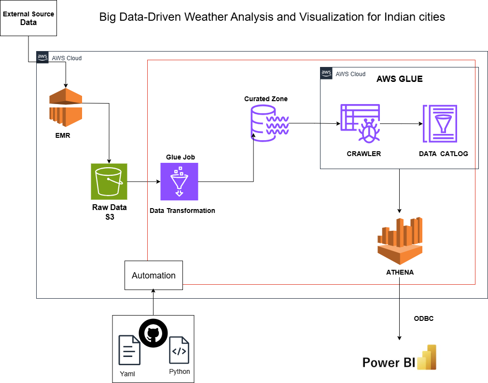
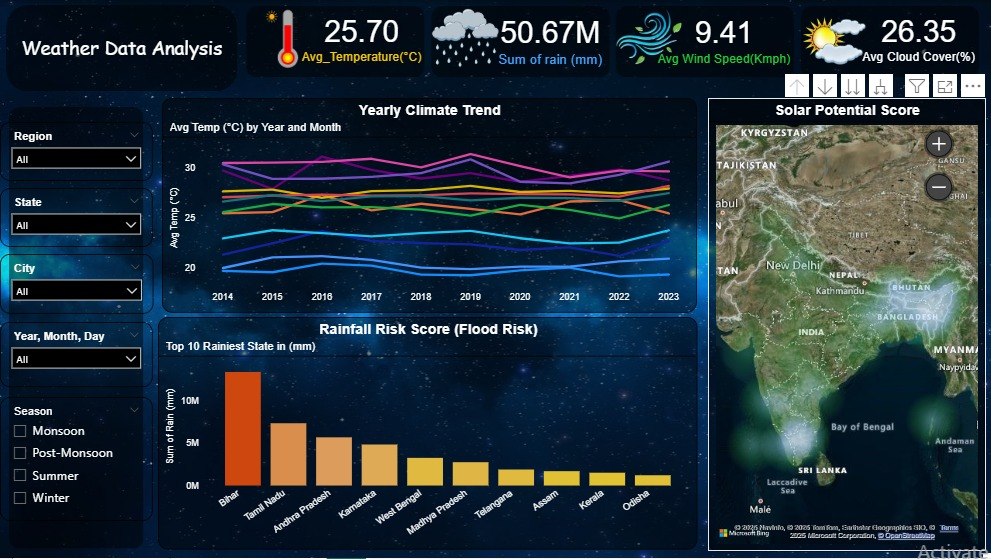
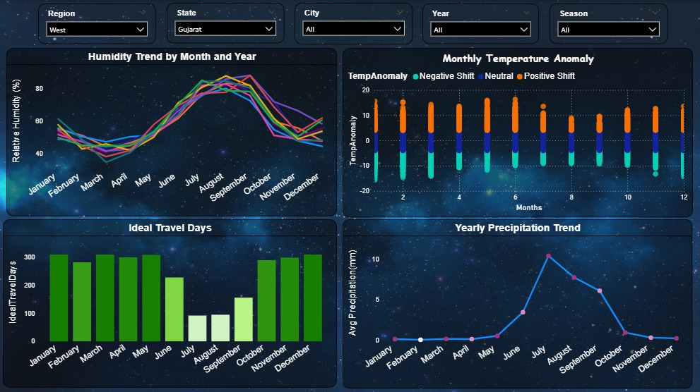

# 🌦️ Big Data-Driven Weather Analysis and Visualization Framework for Indian Cities

## 📌 Overview

This project focuses on the **analysis and visualization** of historical weather data across **4,000+ Indian cities** using Big Data technologies. It leverages distributed data processing frameworks and modern data visualization tools to deliver meaningful climate insights, seasonal pattern detection, and extreme weather tracking..

---

## 🎯 Key Objectivess

- Collect and process large-scale weather data using Big Data tools.
- Clean, transform, and analyze time-series weather records.
- Identify temperature trends, humidity shifts, rainfall variations, and wind behavior.
- Visualize the weather patterns and metrics through interactive dashboards.
- Showcase the power of Big Data in environmental and climate analysis.

---

## 📂 Dataset Information

**Source:** [Kaggle - Indian 4000 Cities Weather Data (2010–2014)](https://www.kaggle.com/datasets/mukeshdevrath007/indian-5000-cities-weather-data)

Each file represents weather metrics for an Indian city. Key columns include:

| Column Name            | Description                           |
| ---------------------- | ------------------------------------- |
| `date`                 | Date of weather observation           |
| `temperature_2m`       | Air temperature at 2 meters (°C)      |
| `relative_humidity_2m` | Relative humidity at 2 meters (%)     |
| `dew_point_2m`         | Dew point temperature (°C)            |
| `apparent_temperature` | Feels-like temperature (°C)           |
| `precipitation`        | Total precipitation (mm)              |
| `rain`                 | Rainfall amount (mm)                  |
| `snowfall`             | Snowfall amount (mm)                  |
| `snow_depth`           | Snow depth on ground (cm)             |
| `pressure_msl`         | Mean sea-level pressure (hPa)         |
| `cloud_cover`          | Overall cloud cover (%)               |
| `wind_speed_10m`       | Wind speed at 10 meters (m/s)         |
| `wind_direction_10m`   | Wind direction at 10 meters (degrees) |

| ...and more.

## 📂 Raw Data Overview

| Attribute         | Details        |
| ----------------- | -------------- |
| **Files**         | 4344 CSV Files |
| **Total Size**    | ~97 GB         |
| **Time Period**   | 2010 – 2024    |
| **Total Rows**    | 52 CR+         |
| **Total Columns** | 21             |

## 🛠️ Technologies Used

## 📊 Project Tech Stack

| Category                               | Tools / Frameworks                            |
| -------------------------------------- | --------------------------------------------- |
| **AWS Cloud Service**                  | AWS S3, AWS Glue, AWS Athena, AWS EMR (Spark) |
| **Programming Language**               | PySpark, SQL                                  |
| **Automation & CI/CD**                 | Terraform, GitHub Actions                     |
| **Project Management & Collaboration** | Jira, GitHub                                  |
| **Visualization Tool**                 | Power BI                                      |

## 📊 Architecture Diagrams

## Key Performance Indicators (KPIs)

- **Solar Potential Score:** Average of `cloud_cover`, `cloud_cover_low`, `cloud_cover_mid`, `cloud_cover_high` to measure solar energy potential.
- **Yearly Climate Trends:** Track `temperature_2m` over `year`, `month`, and `date` to analyze temperature patterns.
- **Rainfall Risk Score:** Evaluate rainfall risk using `state`, `city`, `rain`, and `precipitation`.
- **Average Humidity:** Measure `relative_humidity_2m` across `year` for humidity trends.
- **Monthly Temperature Anomaly:** Compare current monthly average `temperature_2m` with historical averages to detect unusual temperature shifts.
- **Ideal Travel Days:** Count days meeting comfortable `temperature_2m`, `relative_humidity_2m`, and `rain` thresholds for tourism planning.
- **Yearly Precipitation Trend:** Measure total annual rainfall using `rain` and `precipitation` to track wet/dry year patterns.

---

## 📈 Dashboard's

Below is a preview of our interactive weather analytics dashboard:

